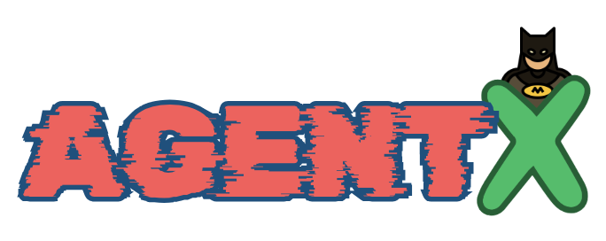

<div align="center">



# **agentX**

🤖 **agentX**: The Ultimate Modular Autonomous AI Agent Framework.


[](https://github.com/decisionfacts/agentX)
[](https://opensource.org/licenses/MIT)

</div>

## Table of contents

- [What is AgentX?](#what-is-agentx)
- [Getting Started](#getting-started)
- [Key Features](#key-features)
- [Installing Dependencies](#installing-dependencies)
- [Contribution](#contribution)
- [License](#license)

## What is AgentX

## Getting Started

## Key Features

## Installing Dependencies
```bash
poetry shell
```

### Pre-commit hooks

```bash
pre-commit install
```

### Running Tests

```bash
poetry run pytest
```

### Running static type checks

```bash
poetry run mypy
```

### Packaging

```bash
poetry build
```

### Installing Locally

```bash
pip install dist/*.tar.gz
```

## Contribution

## License