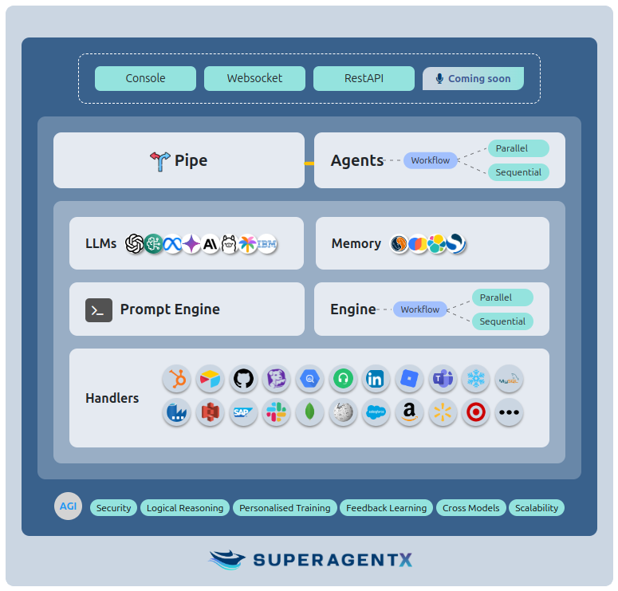
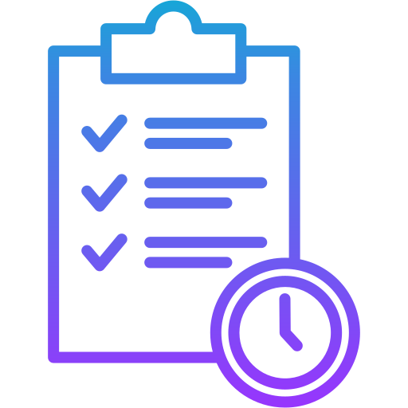

<div align="center">


<br/>

🤖**SuperAgentX**: The Ultimate Modular Autonomous AI Agent Framework for Progressing Towards AGI.

[](https://www.python.org/downloads/release/python-3100/)
[](https://github.com/decisionfacts/agentX)
[](https://opensource.org/licenses/MIT)

</div>

## Table of contents
- [What is AgentX?](#what-is-superagentx)
- [Why AgentX?](#why-superagentx)
- [Getting Started](#getting-started)
- [Key Features](#key-features)
- [Installing Dependencies](#installing-dependencies)
- [Contribution](#contribution)
- [License](#license)

## What is SuperAgentX?

**The Ultimate Modular Autonomous AI Agent Framework for Progressing Towards AGI.** <br/><br/>
SuperAgentX is an advanced agentic AI framework designed to accelerate the development of Artificial General Intelligence (AGI). It provides a powerful, modular, and flexible platform for building autonomous AI agents capable of executing complex tasks with minimal human intervention. By integrating cutting-edge AI technologies and promoting efficient, scalable agent behavior, SuperAgentX embodies a critical step forward in the path towards superintelligence and AGI. Whether for research, development, or deployment, SuperAgentX is built to push the boundaries of what's possible with autonomous AI systems.

## Why SuperAgentX?

SuperAgentX is designed to address the growing need for highly capable, autonomous AI systems that can perform complex tasks with minimal human intervention. As we approach the limits of narrow AI, there's a need for an adaptable and scalable framework to bridge the gap toward AGI (Artificial General Intelligence). Here’s why SuperAgentX stands out:

**Super** : Cutting-edge AI systems with exceptional capabilities, paving the way to **AGI** (Artificial General Intelligence) and **ASI** (Artificial Super Intelligence).</p>
**Agent** : Autonomous Multi AI agent framework designed to make decisions, act independently, and handle complex tasks. </p>
**X**     : The unknown, the limitless, the extra factor that makes SuperAgentX revolutionary, futuristic, and transformative.</p>

## Architecture


## Large Language Models

| Icon                                                                                          | LLM Name          &nbsp;&nbsp;&nbsp;&nbsp;&nbsp;&nbsp;&nbsp;&nbsp;&nbsp;&nbsp;&nbsp; | Status                                                                                   |
|-----------------------------------------------------------------------------------------------|--------------------------------------------------------------------------------------|------------------------------------------------------------------------------------------|
|               | **OpenAI**                                                                           |            |
|     | **Azure OpenAI**                                                                     |            |  
|      | **AWS Bedrock**                                                                      |     |
|        | **Google Gemini**                                                                    |  |
|          | **Meta Llama**                                                                       |  |
|               | **Ollama**                                                                           |  |
|    | **Claude AI**                                                                        |                   |
|  | **Mistral AI**                                                                       |                   |
|          | **IBM WatsonX**                                                                      |                   |


## Getting Started

## Key Features

#### Easy-to-Publish Interfaces
**Pipe** - WebSocket, Interactive Cli Console, and RESTFul API (Coming Soon) enable a smooth and real-time interface for users and systems to interact with SuperAgentX. 

#### Advanced Handler Engines
Handler Engines (Tools) operate either in parallel or sequentially, passing the output from one engine to the input of another. This flexible orchestration enhances efficiency, allowing agents to work in perfect harmony for complex tasks.

#### Multi-Mode Agents
Goal oriented agents with auto retry feature based on threshold, helps to achieve expected results. SuperAgentX supports agents running in parallel, sequential, or a hybrid mode (a combination of both). This ensures optimized task execution, whether processes are dependent or independent.

#### Intelligent Context Memory
A robust Context Memory captures user interactions and environmental data, enabling the system to provide efficient RAG (Retrieval-Augmented Generation) search features, significantly reducing operational costs by handling data intelligently.

#### Ease of Configuration for LLM Support in SuperAgentX
SuperAgentX supports multiple LLMs, including **OpenAI**, **Azure OpenAI**, **AWS Bedrock LLMs**, **Llama 3+**, **Gemini AI**, **Claude AI**, **Ollama** and **IBM WatsonX** is designed to effortlessly integrate with a variety of Large Language Models (LLMs), providing a smooth and flexible setup process.

#### Continuous Learning
Through built-in feedback mechanisms, SuperAgentX continuously learns and adapts, allowing it to memorize and improve its performance for future interactions.

#### Adaptability and Personalization
Highly adaptable and flexible, SuperAgentX can be extended and trained to create personalized **AGI** (Artificial General Intelligence) systems, ensuring that it meets specific needs and scenarios.

### Simplified Autonomous Framework
The **Autonomous Multi-Agent Framework** simplifies the deployment of intelligent, autonomous systems, offering a foundation with **AGI** extendability capabilities, enabling a smooth evolution toward general intelligence.


## Environment Setup
```shell
$ cd <path-to>/superagentx
$ python3.12 -m venv venv
$ source venv/bin/activate
(venv) $ pip install poetry
(venv) $ poetry install
```

## Contribution

## License

SuperAgentX is released under the MIT License.

