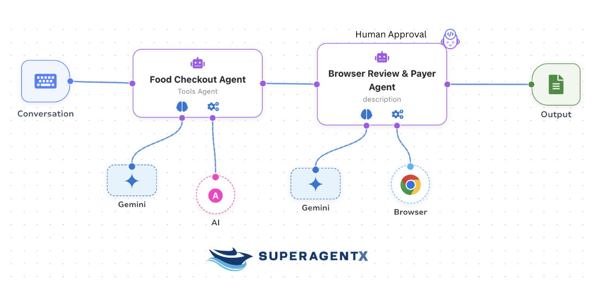

<div align="center">


<br/>


**SuperAgentX**: is an open-source, modular agentic AI framework that enables AI agents to plan, act, and execute real-world workflows—with built-in human approval, governance, and auditability.
Unlike traditional chatbots, SuperAgentX is designed for action, not just conversation.


<br/>

[](https://www.python.org/downloads/release/python-31210/)
[](https://github.com/superagentxai/superagentX)
[](https://github.com/superagentxai/superagentX/blob/master/LICENSE)

</div>

## ✨ Why SuperAgentX?

SuperAgentX enables AI agents to:
- Execute multi-step workflows
- Interact with browsers, APIs, databases, tools & MCPs
- Pause for **human approval** before sensitive actions
- Persist execution state, memory, and audit logs

All while keeping humans firmly in control.

# Quick start

```shell
pip install superagentx
```

## 🧠 Core Capabilities

### 🔹 Massive Model & Tool Support
- ✅ **100+ LLMs supported** (OpenAI, Azure OpenAI, Gemini, Claude, Bedrock, OSS models)
- ✅ **10,000+ MCP (Model Context Protocol) tools supported**
- ✅ **Browser Agents** using real browser automation (Playwright)

---

### 🔹 Agentic AI (Beyond Chatbots)
Agents can:
- Understand goals
- Plan execution steps
- Call tools dynamically
- Run sequential or parallel workflows
- Retry, reflect, and recover

---

### 🔹 Human-in-the-Loop Governance
A built-in **Human Approval Governance Agent**:
- Pauses sensitive actions
- Requests explicit approval
- Resumes or aborts execution
- Persists decisions for audit

➡️ AI **cannot act blindly**.

---

## 🗄️ Persistent Data Store & Memory

### Supported Data Stores
- 🗃 **SQLite** – lightweight, local workflows
- 🗄 **PostgreSQL** – production-grade, multi-tenant systems

### Stored Data
- Workflow state
- Agent decisions
- Human approvals
- Tool outputs
- Audit logs
- Context & memory snapshots

---

## 🧩 Example: AI Food Ordering with Approval
1. Plan order
2. Calculate total
3. Generate checkout summary
4. **Pause for approval**
5. Browser agent completes checkout
6. Persist confirmation & logs



## Browser AI Agent

#### Install Playwright for Browser AI Automation
```bash
pip install playwright
```

```bash
playwright install
```
## Example 1

```python
import asyncio
import json
from superagentx.agent import Agent
from superagentx.agentxpipe import AgentXPipe
from superagentx.browser_engine import BrowserEngine
from superagentx.llm import LLMClient
from superagentx.prompt import PromptTemplate


async def main():
    print("SuperAgentX – Food Checkout & Payment Automation")

    # ------------------------------------------------------------------
    # LLM SETUP
    # ------------------------------------------------------------------
    llm = LLMClient(
        llm_config={
            "model": "gemini/gemini-3-pro-preview",
            "temperature": 0.1
        }
    )

    # ------------------------------------------------------------------
    # AGENT 1: FOOD & SNACKS CHECKOUT AGENT
    # ------------------------------------------------------------------
    checkout_system_prompt = """
    You are a food & snacks checkout agent. Simulate Food & Snacks Checkout with items.

    Task:
    - Select food and snack items
    - Decide quantities
    - Calculate total amount
    - Prepare checkout summary for payment

    Rules:
    - DO NOT generate any payment or card details
    - DO NOT mention CVV, card numbers, or expiry
    - Output ONLY valid JSON

    JSON Schema:
    {
      "items": [
        {
          "name": string,
          "category": "food | snack",
          "quantity": number,
          "price_per_unit": number
        }
      ],
      "currency": "USD",
      "total_amount": number,
      "checkout_note": string
    }
    """

    checkout_prompt = PromptTemplate(system_message=checkout_system_prompt)

    checkout_agent = Agent(
        name="Food Checkout Agent",
        role="Food & Snacks Checkout Planner",
        goal="Prepare checkout summary",
        llm=llm,
        prompt_template=checkout_prompt,
        max_retry=1
    )

    # ------------------------------------------------------------------
    # AGENT 2: BROWSER REVIEW & PAY AGENT
    # ------------------------------------------------------------------
    browser_system_prompt = """
    You are a browser automation agent responsible for review and payment.

    Input:
    - You will receive a checkout summary JSON from the previous agent.

    Target Payment Form URL:
    https://superagentxai.github.io/payment-demo.github.io/

    Task:
    1. Review checkout summary (items & total) and MUST set the price from result.total_amount
    2. Show checkout summary in the popup with price
    3. Generate DUMMY credit card details for testing:
       - 16-digit test card number
       - Future expiry (MM/YY)
       - 3-digit CVV
       - Realistic cardholder name & address
    4. Fill the payment form using generated card details
    5. Submit the form


    Rules:
    - Change the Price value in the submit button with the actual amount from result.total_amount in USD:.
    - Card details must be generated ONLY by you
    - Use dummy/test card numbers only (e.g., 4111 1111 1111 1111)
    - Do NOT persist card data
    - Do NOT assume submission success
    - Extract confirmation text ONLY if visible

    Output JSON:
    {
      "submission_status": "success | failed",
      "reviewed_total_amount": number,
      "confirmation_text": string | null
    }
    """

    browser_prompt = PromptTemplate(system_message=browser_system_prompt)

    browser_engine = BrowserEngine(
        llm=llm,
        prompt_template=browser_prompt,
        headless=False  # set True in CI
    )

    browser_agent = Agent(
        name="Review & Pay Agent",
        role="Browser Payment Executor",
        goal="Review checkout and pay using credit card",
        llm=llm,
        human_approval=True,   # governance point
        prompt_template=browser_prompt,
        engines=[browser_engine],
        max_retry=2
    )

    # ------------------------------------------------------------------
    # PIPELINE: AGENT 1 → AGENT 2
    # ------------------------------------------------------------------
    pipe = AgentXPipe(
        agents=[checkout_agent, browser_agent], # Sequence Agent Workflow
        workflow_store=True
    )

    result = await pipe.flow(
        query_instruction="Checkout food and snacks, then review and pay using credit card."
    )

    formatted_result = [
        {
            "agent_name": r.name,
            "agent_id": r.agent_id,
            "goal_satisfied": r.is_goal_satisfied,
            "result": r.result
        }
        for r in result
    ]

    print(" Final Result (Formatted JSON)")
    print(json.dumps(formatted_result, indent=2))
    return


if __name__ == "__main__":
    asyncio.run(main())

```

## Example 2

```python
import asyncio

from superagentx.agent import Agent
from superagentx.browser_engine import BrowserEngine
from superagentx.llm import LLMClient
from superagentx.prompt import PromptTemplate


async def main():
    llm_client: LLMClient = LLMClient(llm_config={'model': 'gpt-4.1', 'llm_type': 'openai'})

    prompt_template = PromptTemplate()

    browser_engine = BrowserEngine(
        llm=llm_client,
        prompt_template=prompt_template,

    )
    query_instruction = ("Which teams have won more than 3 FIFA World Cups, and which team is most likely to win the "
                         "next one?")

    fifo_analyser_agent = Agent(
        goal="Complete user's task.",
        role="You are a Football / Soccer Expert Reviewer",
        llm=llm_client,
        prompt_template=prompt_template,
        max_retry=1,
        engines=[browser_engine]
    )

    result = await fifo_analyser_agent.execute(
        query_instruction=query_instruction
    )

    print(result)


asyncio.run(main())

```
## Run


## Key Features

🚀 **Open-Source Framework**: A lightweight, open-source AI framework built for multi-agent applications with Artificial General Intelligence (AGI) capabilities.

🎯 **Goal-Oriented Multi-Agents**: This technology enables the creation of agents with retry mechanisms to achieve set goals. Communication between agents is Parallel, Sequential, or hybrid.

🏖️ **Easy Deployment**: Offers WebSocket, RESTful API, and IO console interfaces for rapid setup of agent-based AI solutions.

♨️ **Streamlined Architecture**: Enterprise-ready scalable and pluggable architecture. No major dependencies; built independently!

📚 **Contextual Memory**: Uses SQL + Vector databases to store and retrieve user-specific context effectively.

🧠 **Flexible LLM Configuration**: Supports simple configuration options of various Gen AI models.

🤝 **Extendable Handlers**: Allows integration with diverse APIs, databases, data warehouses, data lakes, IoT streams, and more, making them accessible for function-calling features.

💎 **Agentic RPA (Robotic Process Automation)** – SuperAgentX enables computer-use automation for both browser-based and desktop applications, making it an ideal solution for enterprises looking to streamline operations, reduce manual effort, and boost productivity.


### Getting Started

```shell
pip install superagentx
```
##### Usage - Example SuperAgentX Code
This SuperAgentX example utilizes two handlers, Amazon and Walmart, to search for product items based on user input from the IO Console.

1. It uses Parallel execution of handler in the agent 
2. Memory Context Enabled
3. LLM configured to OpenAI
4. Pre-requisites

## Environment Setup
```shell
$ python3.12 -m pip install poetry
$ cd <path-to>/superagentx
$ python3.12 -m venv venv
$ source venv/bin/activate
(venv) $ poetry install
```

## [Documentation](https://docs.superagentx.ai/introduction)

## License

SuperAgentX is released under the [MIT](https://github.com/superagentxai/superagentX/blob/master/LICENSE) License.

## 🤝 Contributing
Fork → Branch → Commit → Pull Request  
Keep contributions modular and documented.

## 📬 Connect
- 🌐 https://www.superagentx.ai
- 💻 https://github.com/superagentxai/superagentx

⭐ Star the repo and join the community!
