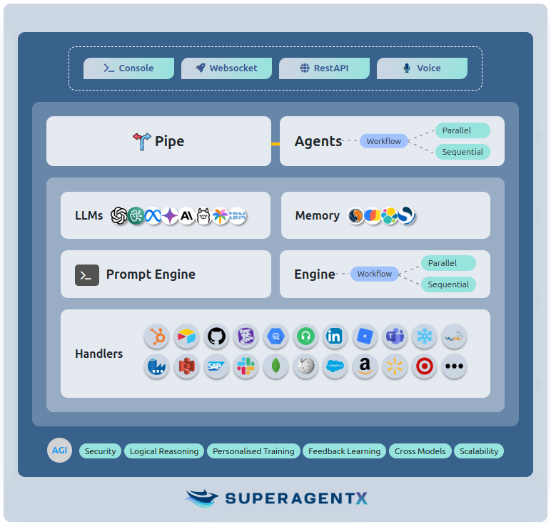

**An Open Source Autonomous Multi-Agent Framework driving the path towards Artificial General Intelligence (AGI) and Artificial Superintelligence (ASI)** .

## Why SuperAgentX?

**Super** : Advanced AI systems with extraordinary capabilities, pioneering the path to AGI (Artificial General Intelligence) and ASI (Artificial Super Intelligence).

**Agent** : Autonomous Multi AI agent framework designed to make decisions, act independently, and handle complex tasks.

**X** : The unknown, the limitless, the extra factor that makes SuperAgentX revolutionary, futuristic, and transformative.

<Frame>
  
</Frame>

***SuperAgentX Components***

- 🚀 **Agents** - Goal oriented agents with auto retry feature - agents running in parallel, sequential, or a hybrid mode.
- 🏖️ **Pipe** - Real-time interface for users and systems to interact with SuperAgentX deployments using WebSocket, Interactive Cli Console, and RESTFul APIs.
- 📚 **Memory** - robust Context Memory captures user interactions and environmental data, enabling the system to provide efficient RAG (Retrieval-Augmented Generation).
- 🧠 **Gen AI Models** - Supports multiple LLMs, including OpenAI, Azure OpenAI, AWS Bedrock LLMs, Llama 3+, Gemini AI, Claude AI, Ollama and IBM WatsonX.

It provides a powerful, modular, and flexible platform for building autonomous AI agents capable of executing complex tasks with minimal human intervention.
By integrating cutting-edge AI technologies and promoting efficient, scalable agent behavior, SuperAgentX embodies a critical step forward in the path towards superintelligence and AGI.
Whether for research, development, or deployment, SuperAgentX is built to push the boundaries of what is possible with autonomous AI systems.

<CardGroup cols={2}>
  <Card
    title="Add Components"
    icon="screwdriver-wrench"
    href="https://mintlify.com/docs/components/accordion"
  >
    Build interactive features and designs to guide your users
  </Card>
  <Card
    title="Get Inspiration"
    icon="stars"
    href="https://mintlify.com/customers"
  >
    Check out our showcase of our favorite documentation
  </Card>
</CardGroup>
